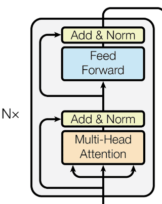
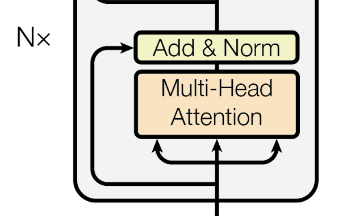
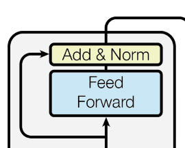
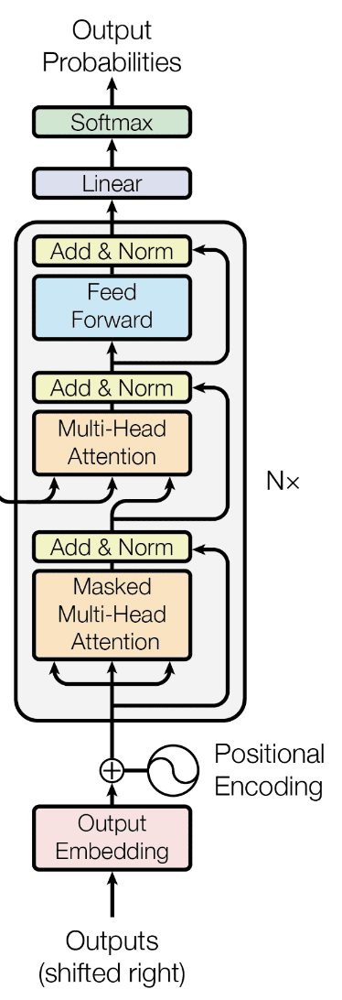

# Understanding the Transformers Architecture

Note:
  - This blog is written to understand what happens internally in the Transformers code.
  - I have used one simple example where I have a Source Sentence, represented in Tensor as `tensor([[1, 5, 6, 4, 3, 9, 5, 2, 0]])`
  - and a Target Sentence, represented in Tensor as `tensor([[1, 7, 4, 3, 5, 9, 2, 0]])`
  - The Input and Output are passed to the Encoder, Decoder blocks to understand how the data is handled, what will be the output and shape of the tensors in each stage

## Data Understanding:

- Shape of the Source Tensor - `torch.Size([1, 9])`
  * Batch Size is `1`. We just have only one input sentence
  * The length of the input sequence is `9`
- Shape of the Target Tensor - `torch.Size([1, 8])`
  * Batch Size is `1`. We have one corresponding target tensor
  * The length of the target sentence is `8`
- The Padding Index will be `0` while padding the input and output sentence
- The Source and Target Vocabulary size is `10`

## Encoder:

### Preparing the Input for Encoder:

`src` and `src_mask`
- `src` -> `tensor([[1, 5, 6, 4, 3, 9, 5, 2, 0]])`
- Shape of the `src` -> `torch.Size([1, 9])`
- Let's understand the `src_mask`
  * Inside a batch, the input sequence length will vary for each source sentence. The Sequence length is determined to be the maximum length of the sentence available in the training dataset. So, for the rest of the training dataset, the (max_length - len(current_sentence)) is set to be masked.
  * For the `src_mask` in our example will be `tensor([[[[ True,  True,  True,  True,  True,  True,  True,  True, False]]]])`.
  * The value `0` denotes that it is a padded token. So `False` as a last element in the `src_mask`

### Encoder Initialization:
- The `embedding_size` is 256
- The `word_embedding` dimension is configured to `(src_vocab_size, embedding_size)` = `(10, 256)`. The Source sentence's vocabulary size is `10`
- The `position_embedding` dimension is configured to `(max_sequence_length, embedding_size)` = `(9, 256)`. The Sequence length of the source sentence is `9`

Now we're ready with the `src` and `src_mask`, lets understand what the `Encoder` does internally
- As a first step, the `position_embeddings` and `word_embeddings` are calculated
- We have the sequence length as `9`. And the batch size as `1`. So the `position_embeddings` shape is initialized to `(1,9)` Later Calculated
- After passing the `source` statement to the `word embedding` layer, the `word_embeddings` dimension is resulted as `torch.Size([1, 9, 256])`
- After passing the `position` to the `position embedding` layer, the `position_embeddings` dimension is resulted as `torch.Size([1, 9, 256])`
- The `word_embedding` and `position_embedding` are added, `out = result_of_word_embedding + result_of_position_embedding`.
- `out` is the `value`, `key` and `query` to the `Transformer Block`  

### Encoder Calling the `Transformer Block`

The `out` which will be the `value`, `key` and `query` sent to the `Transformer Block`. The `Encoder` is configured with `6` layers. It means the `Transformer Block` is called `6` times

Let's understand the `Transformer Block`

The Transformer block is comprised of (sequentially), 
  1.  Multihead Attention layer
  2.  Add & Norm
  3.  Feed Forward layer
  4.  Add & Norm

  #### 1. Multihead Attention Layer:

  

  - `Self Attention` Initialization:
    * The number of `heads` are configured in the beginning as `8`
    * The `embed` dimension is set to `256`
    * Calculate the dimension for each `head`; `dimension_of_each_head` is `(256/8) = 32`
    * A `Linear` layer is initialized for `value`, `key` and `query`
    * `Linear Layer for value` - with the shape of `(dimension_of_each_head, dimension_of_each_head)` -> `(32, 32)`
    * `Linear Layer for key` - with the shape of `(dimension_of_each_head, dimension_of_each_head)` -> `(32, 32)`
    * `Linear Layer for Fully Connected Output` - with the shape of `(dimension_of_each_head*number_of_heads, dimension_of_each_head)` -> `(32*8, 256)` -> `(256, 256)`
  - `Self Attention` Mechanism: This block runs 6 times
    * `LOOP 6 times`
      - The `key`, `value` and `query` are received
      - `key`, `value`, `query` Shape is `(1,9,256)`
      - From the above, we can understand that, the `Self Attention` takes the `Batch Size` - `1`; Sequence length of the input source `9`; The embedding dimension is `256`
      - The `value_length` is extracted from the shape of `value` <- `value.shape[1]` which is nothing but `9` from `(1,9,256)`
      - The `key_length` is extracted from the shape of `key` <- `key.shape[1]` which is nothing but `9` from `(1,9,256)`
      - The `query_length` is extracted from the shape of `query` <- `query.shape[1]` which is nothing but `9` from `(1,9,256)`
      - Convert the `value`, `key` and `query` into a `Linear` layer each. After the conversion, the shape of `value`, `key` and `query` will be `torch.Size([1, 9, 8, 32])` which is nothing but `(batch_size, sequence_length, number_of_heads, dimension_of_each_head)`
      - The `energy` from the `Attention` formula is represented as  `energy = query * transpose(key)`. 
      - To achieve this, `energy = torch.einsum("nqhd, nkhd -> nhqk", [queries, keys])`. Refer torch.einsum documentation.
      - `nqhd` denotes the shape of the `query` -> `(1,9,8,32)`; 
        * `n=1` is the `batch_size`; `q=9` is the `sequence_length`; `h=8` is the `number of heads`; `d=32` is the `dimension_of_head`;
      - `nkhd` denotes the shape of the `key` -> `(1,9,8,32)`
        * `n=1` is the `batch_size`; `k=9` is the `sequence_length`; `h=8` is the `number of heads`; `d=32` is the `dimension_of_head`;
      - The matrix multiplication of `query * transpose(key)` is achieved by `energy = torch.einsum("nqhd, nkhd -> nhqk", [queries, keys])`.
      - The resulting `energy` `(n,h,q,k)` will be of shape `torch.Size([1, 8, 9, 9])`
        * `n=1` is the `batch_size`; `h=8` is the `number of heads`; `q=9` is the `query`'s `sequence_length`; `k=9` is the `key`'s `sequence_length`
      - In the `energy`, the masked `tensor element` - `0` is set to `-infinity`. When a `Softmax` is run, the negative infinity will ultimately turn to `Zero`
      - `attention` is calculated using the `attention = torch.softmax(energy/(self.embed_size**(1/2)), dim=3)`
        * the `softmax` is calculated across the `key` dimension `(dim=3)`
        * the `energy` is of shape `(1, 8, 9, 9)`
        * the `square_root` of `embedding_size=256` which is `square_root(256) = 16`
        * the `tensor` division operation is done on the `energy` object like this `energy_tensor / 16`
        * `softmax` is applied on the above result across the dimension `3` which corresponds to `key`
        * storing the result of above step into the `attention` tensor
      - `add` all the `8 heads` into single `head` by reshaping and sending it to a `fully connected neural network`
        * Along with the `attention`, we need to send the `value` aswell. To do this, the `attention` and `values` are multiplied (matrix)
        * The result is stored inside `out` variable
        * `out = torch.einsum("nhql,nlhd -> nqhd", [attention, values]).reshape(N, query_len, self.heads*self.head_dim)` Refer torch.einsum documentation. 
        * From the above, Shape of `attention` is represented as `torch.Size([1, 8, 9, 9])` -> `(n,h,q,l)`; `n=1` is the `batch_size`; `h=8` is the `number of heads`; `q=8` is the `query` sequence_length; `l=9` is the `value` sequence_length
        * Shape of `values` is represented as `(1,9,8,32)` -> `(n,l,h,d)`; `n=1` is the `batch_size`; `l=9` is the sequence_length of the `key`; `h=8` is the `number of heads`; `d=32` is the dimension of `1 head`
        * The matrix multiplication results as `(1,9,8,32)` -> `(n,q,h,d)`;  `n=1` is the `batch_size`; `q=9` is the sequence_length of the `query`; `h=8` is the `number of heads`; `d=32` is the dimension of `1 head`
        * The result of the above step will be `(1,9,256)` -> `(N, query_length, numberOfHeads*dimension_of_each_head)` which is `(1,9,8*32)` = `(1,9,256)`
        * The result is then passed to a `Fully Connected Neural Network` where the sum of all the `8 heads` happens and results in the shape of `(1,9,256)`
        * This particular iteration results a tensor with the shape - `(1,9,256)`

  #### 2. Add & Normalization Layer:
  
  - `Add & Normalization` This block runs immediately after calculating the Multihead Attention
    * The inputs to the block will be the calculated by adding `attention-output` and the `query` which comes as a skip connection from the `inputs`
    * The shape of the `attention-output` will be `(1,9,256)`; The shape of the `query` will be `(1,9,256)`.
    * The tensor addition of `attention-output` + `query` is done and results in the shape of `(1,9,256)`
    * Normalization is done post the addition, and results in the shape of `(1,9,256)`.
    * This result is sent to the `Feed Forward Neural Netword`

  #### 3. Feed Forward Neural Network:
  

  - `Feed Forward Neural Network` This block runs immediately after performing `Add & Normalization` layer
    * The inputs to the block will be a tensor of the shape `(1,9,256)`. `1` is the `Batch Size`; `9` is the `sequence_length`; `256` is the `embedding_dimension`
    * This feed forward neural network processes and results - `(1,9,256)`. `1` is the `Batch Size`; `9` is the `sequence_length`; `256` is the `embedding_dimension`

  #### 4. Add & Normalization Layer:
  

  - `Add & Normalization` This block runs immediately after the `Feed Forwad Neural Network`
    * The inputs to the block will be calculated by adding `3. Feed Forward Neural Network` output and the `2. Add & Normalization Layer`'s which comes as a skip connection.
    * The shape of the `3. Feed Forward Neural Network` output will be `(1,9,256)`; The shape of the `2. Add & Normalization Layer`'s will be `(1,9,256)`
    * The tensor addition of `3. Feed Forward Neural Network` output + `2. Add & Normalization Layer`'s output is done and results in the shape of `(1,9,256)`
    * Normalization is done post the addition, and results in the shape of `(1,9,256)`
    * At this point, this will be the result from Encoder. This is sent as a `value` and `key` to the Decoder

## Decoder:

### Preparing the Input for Decoder:

`trg`, `enc_src`, `src_mask`, `trg_mask`

- `trg` -> `tensor([[1, 7, 4, 3, 5, 9, 2]])`
- Shape of the `trg` -> `torch.Size([1, 7])`
- Let's understand the `trg_mask`. The `trg_mask` looks like this, 

         `tensor([[[[1., 0., 0., 0., 0., 0., 0.],
                    [1., 1., 0., 0., 0., 0., 0.],
                    [1., 1., 1., 0., 0., 0., 0.],
                    [1., 1., 1., 1., 0., 0., 0.],
                    [1., 1., 1., 1., 1., 0., 0.],
                    [1., 1., 1., 1., 1., 1., 0.],
                    [1., 1., 1., 1., 1., 1., 1.]]]])`
    As you can see, the shape of the `trg_mask` is `torch.Size([1, 1, 7, 7])`. We have `7` rows running parallely. In the 
    * first row, expect the first `token`, rest all the tokens are masked
    * second row, except the first, second `tokens` rest all the tokens are masked, and so on.
    This is done to, let the decoder know that, you've 7 tokens to be predicted (except the first `token`), parallely. For example, the for the first row - the decoder should predict the second word for the given first word.

- `src_mask` - Refer "Preparing the Input for Encoder"
- `enc_src` - This is the output got from the `Encoder` block. This is `key`, and `value`.

### Decoder Initialization:

- The `embed_size` is `256`
- Initialize the `word_embedding` and The shape of the `word_embedding` is `(trg_vocab_size, embed_size)` -> `(10, 256)`
- Initialize the `position_embedding` and The shape of the `position_embedding` is `(max_length, embed_size)` -> `(max_length of the target sentences, 256)`
- Initialize `7 Decoder Blocks`
- Initialize a `Fully Connected` layer with the shape - `(embed_size, trg_vocab_size)`
- Initialize a `Dropout layer`

### Decoder - Prepare the data in the `forward` block to call the `Decoder Block`

- `x` is the target tensor. 
- `N = 1` is the `batch size`; `seq_length = 7` is the length of the `target`
- The `target positions` are calculated as `tensor([[0, 1, 2, 3, 4, 5, 6]])`
- The `word_embdding` and `positional_embedding` are added and the result is store in `x`. `x` will be the `target` input sent to the `Decoder Blocks`

### Decoder Block Initialization:

Total, `6` Decoder Blocks are created. This is configured as a `num_layers` while initializing the `Decoders`

- 

